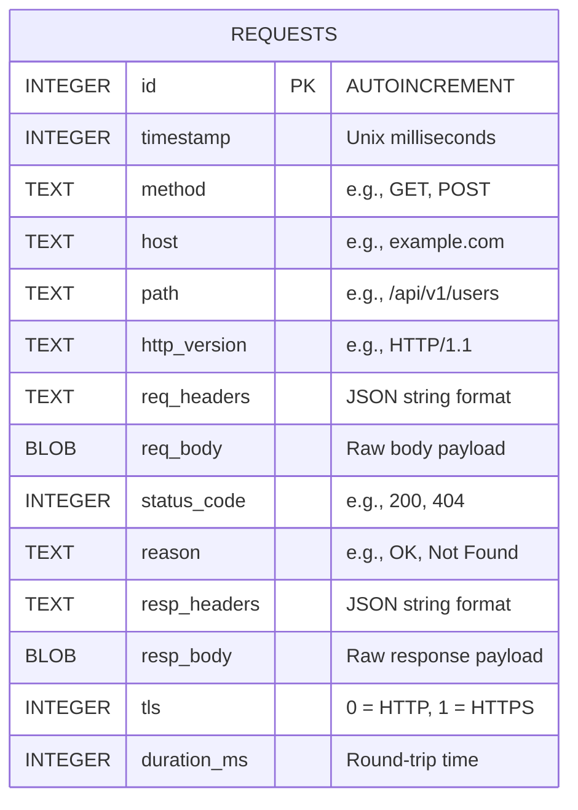

# Database & Data Schema Specification: BurpTUI

## 1. Overview
BurpTUI uses embedded SQLite3 for persistent storage of HTTP/HTTPS traffic history. This allows the application to maintain session history across restarts and provides a robust engine for searching and filtering traffic.

## 2. Storage Rules & Configuration
- **File Location:** `data/history.db`
- **Journal Mode:** `WAL` (Write-Ahead Logging). This is explicitly enabled (`PRAGMA journal_mode=WAL`) to allow the UI thread to perform `SELECT` queries concurrently while the proxy background threads perform `INSERT` operations, preventing database lock contentions.
- **Prepared Statements:** All inserts and queries must use compiled `sqlite3_prepare_v2` statements to ensure performance and prevent SQL injection.
- **Large Blobs:** Response bodies exceeding 1MB are truncated in the DB to prevent memory/storage bloat. A truncation flag is indicated in the headers or separate column.

## 3. Entity-Relationship Diagram


## 4. Schema Definition

### 4.1 Table: `requests`
| Column Name | Data Type | Constraints | Description |
|---|---|---|---|
| `id` | `INTEGER` | `PRIMARY KEY AUTOINCREMENT` | Unique identifier for the traffic pair. |
| `timestamp` | `INTEGER` | `NOT NULL` | The exact Unix timestamp (in milliseconds) when the request was initiated. |
| `method` | `TEXT` | `NOT NULL` | The HTTP method (GET, POST, PUT, DELETE, OPTIONS, etc.). |
| `host` | `TEXT` | `NOT NULL` | The target hostname or IP address. |
| `path` | `TEXT` | `NOT NULL` | The request URI/path and query string. |
| `http_version` | `TEXT` | `NOT NULL` | The HTTP version used (HTTP/1.1). |
| `req_headers` | `TEXT` | `NOT NULL` | The request headers serialized as a JSON string for easy extraction. |
| `req_body` | `BLOB` | | The raw binary payload of the request (if any). |
| `status_code` | `INTEGER` | | The HTTP status code returned by the server (e.g., 200). Nullable if request failed. |
| `reason` | `TEXT` | | The reason phrase returned by the server (e.g., OK). |
| `resp_headers` | `TEXT` | | The response headers serialized as a JSON string. |
| `resp_body` | `BLOB` | | The raw binary payload of the response (if any). |
| `tls` | `INTEGER` | `NOT NULL DEFAULT 0`| Boolean representation indicating if the traffic was encrypted (1) or plain (0). |
| `duration_ms` | `INTEGER` | | Total round-trip time in milliseconds. |

## 5. Indexes
To support fast searching and filtering in the History tab, the following indexes are strictly enforced:

```sql
CREATE INDEX idx_host ON requests(host);
CREATE INDEX idx_timestamp ON requests(timestamp);
CREATE INDEX idx_status ON requests(status_code);
```
